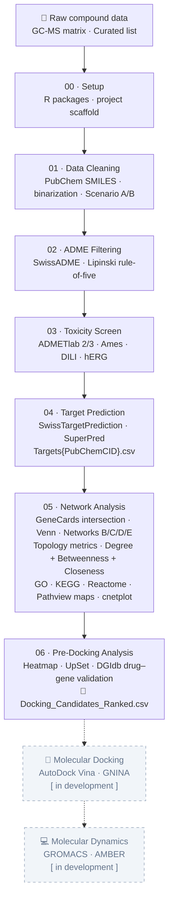

# Network Pharmacology Cookbook 🌿

[](LICENSE)
[](https://www.r-project.org/)

**Author:** Edgard Uriel López Chablé  
**Group:** Laboratorio de Investigación Química y Farmacológica de Productos Naturales, Posgrado en Ciencias Químico Biológicas, UAQ

A reproducible, step-by-step R pipeline for **network pharmacology analysis of plant extracts**, from raw compound data to pre-docking candidate prioritization. Developed and validated using phenolic compounds from *Sphaeralcea angustifolia*.

> **Why this cookbook?** Network pharmacology papers are common but fully documented, reproducible pipelines are rare — most groups publish results without code. This repository is designed so that a researcher can follow the workflow from zero, understand each methodological decision, and adapt it to their own extract and disease of interest.

---

## Pipeline Overview



---

## Pipeline at a Glance

| Step | Tool(s) | Output |
|------|---------|--------|
| 00 Setup | CRAN · Bioconductor | R environment · folder scaffold |
| 01 Data Cleaning | webchem · PubChem API | SMILES · binary compound matrix |
| 02 ADME Filtering | SwissADME · Lipinski | `compounds_filtered.csv` |
| 03 Toxicity | ADMETlab 2/3 | `compounds_safe.csv` |
| 04 Target Prediction | STP · SuperPred | `df_targets.csv` |
| 05 Network Analysis | igraph · STRINGdb · clusterProfiler · ReactomePA | Networks B/C/D/E · GO/KEGG/Reactome tables · Pathview maps |
| 06 Pre-Docking | pheatmap · UpSetR · DGIdb API | Heatmap · UpSet · `Docking_Candidates_Ranked.csv` |

---

## Repository Structure

```
network-pharmacology-cookbook/
├── LICENSE
├── README.md
├── .gitignore
├── 00_setup/               R packages + project scaffold
├── 01_data_cleaning/       SMILES retrieval, replicate collapsing, binarization
├── 02_adme_filtering/      SwissADME / Lipinski filtering
├── 03_toxicity_filtering/  ADMETlab2/3 toxicity screen
├── 04_target_prediction/   File naming convention + prediction consolidation
├── 05_network_analysis/    Disease target intersection, networks, enrichment
│   └── output/             Generated figures, tables, and pathview maps
├── 06_predocking_analysis/ Heatmaps, UpSet, centrality, DGIdb, candidate table
│   └── output/             Generated figures and candidate CSVs
├── example_data/           Ready-to-run dataset (8 phenolics, Sphaeralcea angustifolia)
│   ├── 04_targets/         Targets<PubChemCID>.csv files
│   └── 05_genecards/       GeneCards disease target CSVs
└── reference/              Database headers and expected column formats
```

---

## Quick Start (Example Data)

Each `.Rmd` file has this flag at the top:

```r
USE_EXAMPLE_DATA <- TRUE   # ← flip to FALSE for your own project
```

When `TRUE`, scripts load the bundled 8-compound dataset. Set to `FALSE` and update file paths for your own data.

Run files **in order**: `00` → `01` → `02` → `03` → `04` → `05` → `06`.

> All `.Rmd` files use `knitr::opts_knit$set(root.dir = normalizePath(".."))` in the setup chunk so that all paths are relative to the cookbook root. This is intentional.

---

## Input Data Scenarios

**Scenario A — GC-MS matrix:**  
Compound × sample abundance matrix with replicate columns per condition (format: `R<n>-<CONDITION>`, e.g. `R1-LEA-ET`, `R2-FLO-AQ`). Run Steps 01–06.

**Scenario B — Curated compound list:**  
Table with compound names, PubChemCIDs, and SMILES (from literature or manual curation). Start at Step 02.

---

## Key Convention: `Targets<PubChemCID>.csv`

Target prediction files are named using the **PubChem Compound ID (CID)**, not the CAS number.

> **Why not CAS?** A single compound can have multiple valid CAS numbers across databases. The PubChem CID is unique, stable, and unambiguous.

Example: Apigenin → `Targets5280443.csv`  
Find any CID: https://pubchem.ncbi.nlm.nih.gov/

---

## Supported Target Prediction Servers

| Server | URL |
|--------|-----|
| SwissTargetPrediction | https://www.swisstargetprediction.ch/ |
| SuperPred | https://prediction.charite.de/ |

Column names differ between servers and versions — see `reference/database_headers.md`.

---

## Bacterial-specific considerations

> Not applicable — this pipeline targets **human disease** using *Homo sapiens* as the
> reference organism throughout (PubChem, STRING, GeneCards, GO/KEGG). For non-model
> organisms, additional annotation steps (e.g., eggNOG-mapper) would be required.

---

## Dependencies

See `00_setup/00_setup.Rmd` for the full installation block.

**CRAN:** `tidyverse`, `igraph`, `ggraph`, `ggVennDiagram`, `pheatmap`, `UpSetR`, `RColorBrewer`, `httr`, `jsonlite`, `fs`, `magick`

**Bioconductor:** `clusterProfiler`, `org.Hs.eg.db`, `ReactomePA`, `enrichplot`, `pathview`

**Optional:** `GOplot` (GOChord diagram)

---

## Citation

If you use this pipeline in your research, please cite:

> López-Chablé, E.U. (2026). *Network Pharmacology Cookbook* (v1.0.0). Zenodo. https://doi.org/10.5281/zenodo.XXXXXXX

---

## AI Disclosure

Portions of this code were developed with AI assistance (Claude, Anthropic) and manually validated, debugged, and adapted by the author. All methodological decisions, biological interpretation, and experimental design are the author's own.

---

## Author

**Edgard Uriel López Chablé**  
QFB Student, 5th semester · Universidad Autónoma de Querétaro (UAQ)  
Junior Researcher — Laboratorio de Investigación Química y Farmacológica de Productos Naturales  

---

## License

MIT © 2026 Edgard Uriel López Chablé — see [LICENSE](LICENSE).  
Free to use and adapt with attribution.
